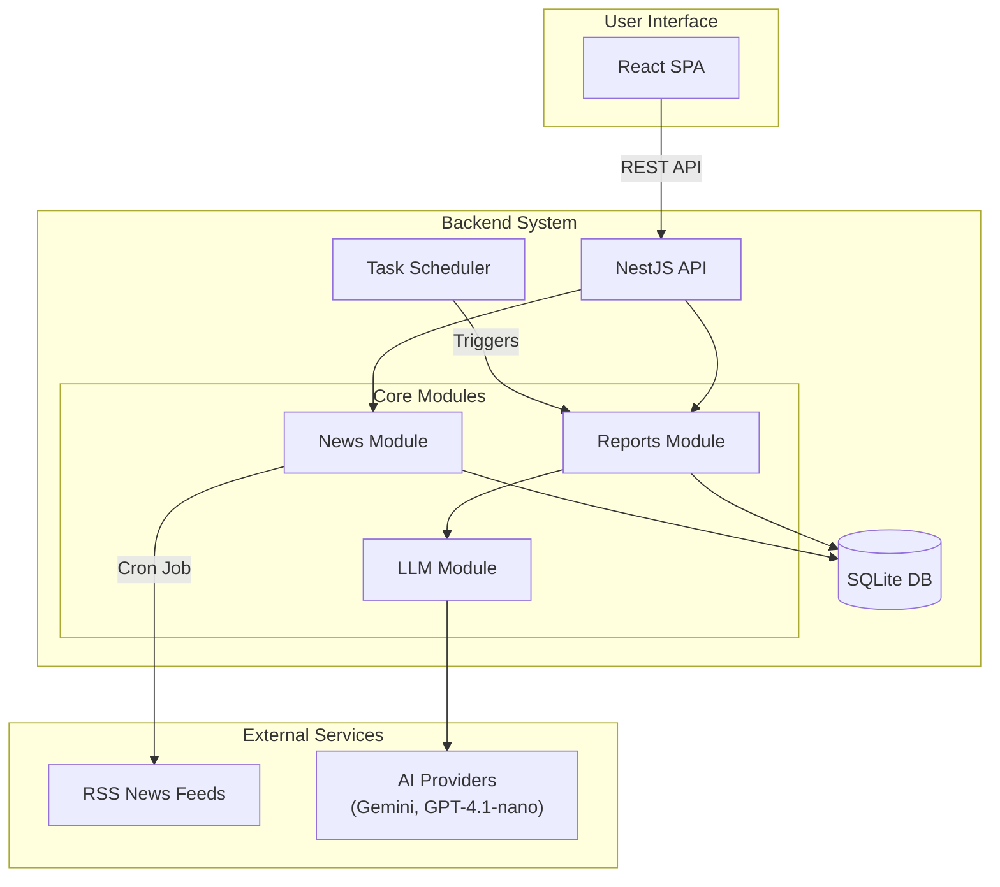
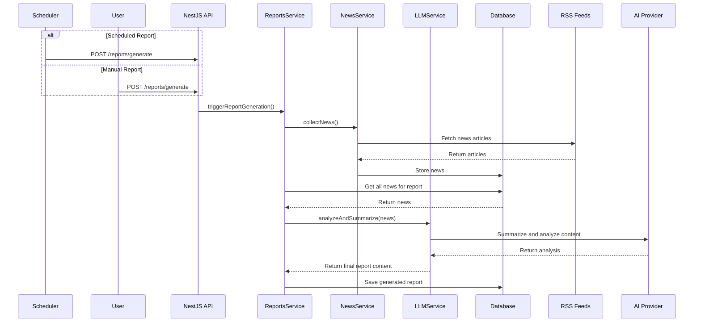
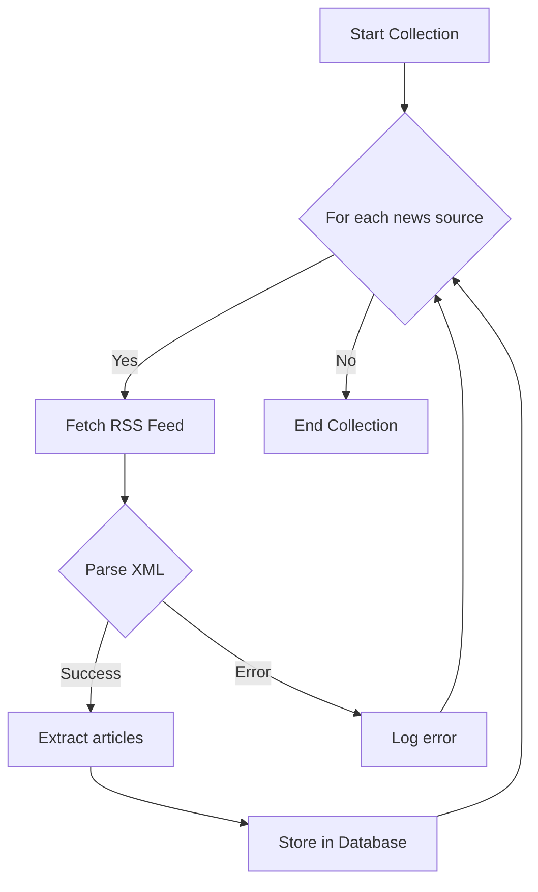

# Auto Investment Helper

AI-powered investment analysis and report generation service for value investors.

## System Architecture



## Report Generation Flow

Automated investment reports are generated twice daily (8 AM, 6 PM KST) or on-demand.



## News Collection Process



## Tech Stack

| Component | Technology |
|-----------|------------|
| Frontend  | React 19, TypeScript, Tailwind CSS |
| Backend   | NestJS, TypeScript, TypeORM |
| Database  | SQLite |
| AI        | Gemini 2.5 Flash (primary), GPT-4.1-nano (fallback) |

## Quick Start

```bash
# Clone and setup
git clone <repository-url>
cd auto-investment-helper
cp backend/.env.example backend/.env
# Add GEMINI_API_KEY to backend/.env

# Install and run
npm install
npm run dev
```

**Endpoints:**
- Backend: `http://localhost:3001`
- Frontend: `http://localhost:3000`

## Key Commands

| Command | Purpose |
|---------|---------|
| `npm run dev` | Start both servers |
| `npm run build` | Production build |
| `npm test` | Run all tests |
| `npm run lint` | Code formatting |

## API Reference

- `GET /reports` - List reports (paginated)
- `GET /reports/:id` - Get specific report  
- `POST /reports/generate/:type` - Generate report (`morning`/`evening`)
- `GET /news/stats` - News collection statistics
- `POST /news/collect` - Manual news collection
- `GET /health` - Service health check

## Configuration

Key service files for customization:

- **News Sources**: `backend/src/modules/news/news.service.ts`
- **AI Models**: `backend/src/modules/llm/llm.service.ts`  
- **Scheduling**: `backend/src/modules/reports/scheduler.service.ts`

## Documentation

- [API Reference](./docs/api-reference.md)
- [Development Guide](./docs/development-guide.md)
- [Deployment Guide](./docs/deployment-guide.md)

## License

ISC

## Notes

- Gemini API key required
- Check database paths and security settings for production
- Monitor API usage costs
