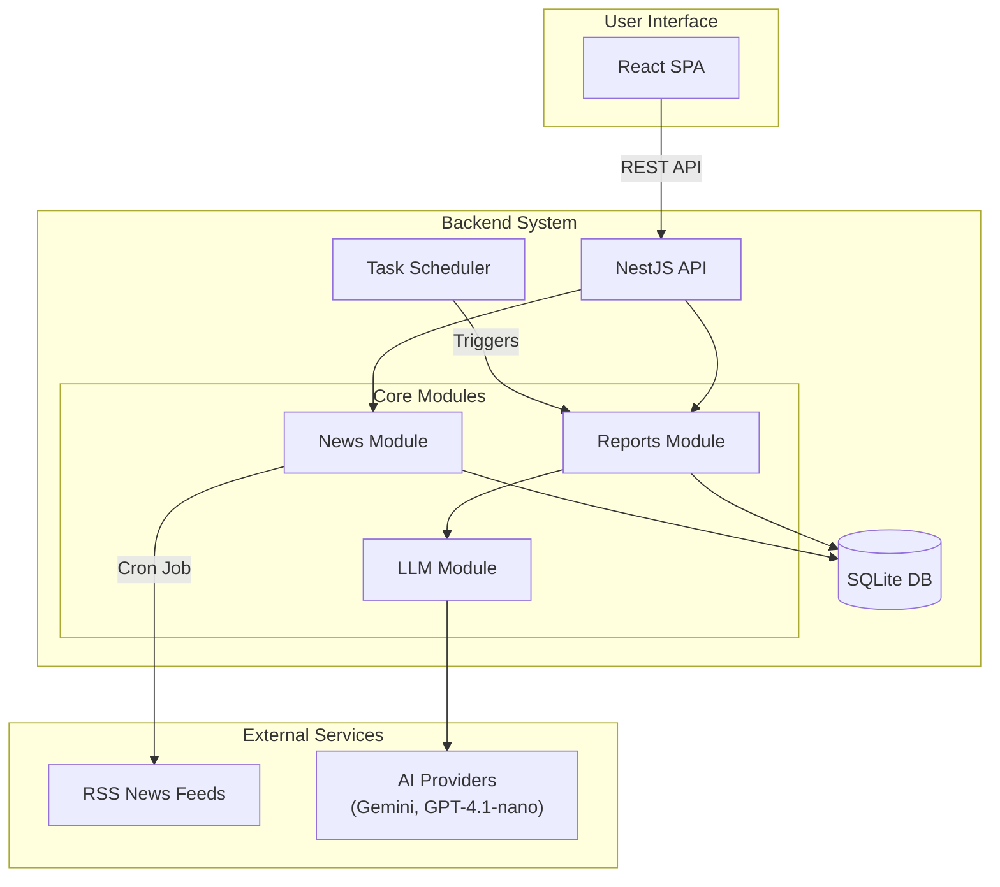
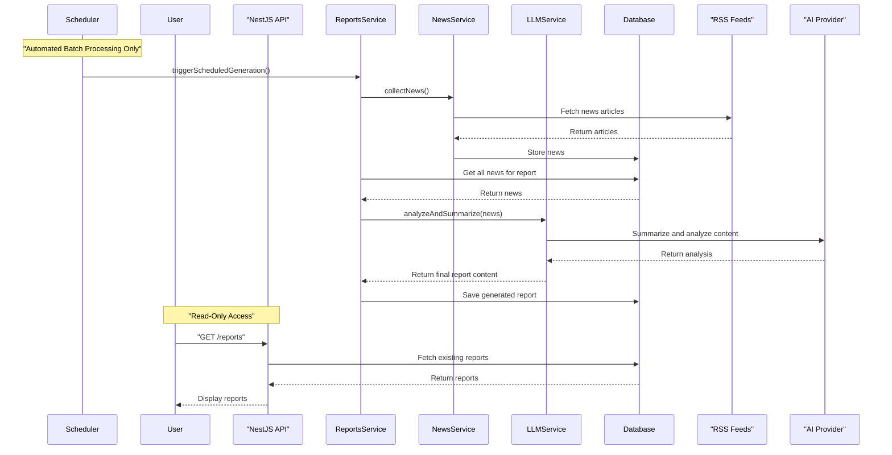
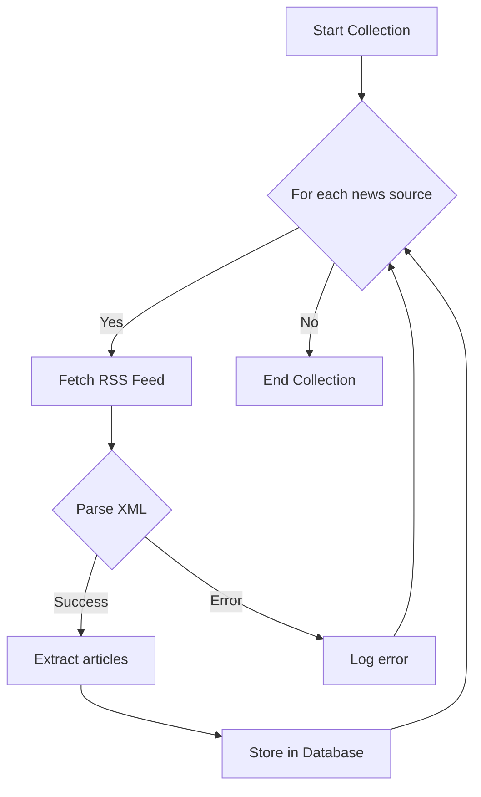

# Auto Investment Helper

AI-powered investment analysis and report generation service for value investors.

## System Architecture



## Report Generation Flow

Investment reports are automatically generated via scheduled batch jobs twice daily (8 AM, 6 PM KST). No manual report generation is supported to control AI costs and ensure consistent timing.



## News Collection Process



## Tech Stack

| Component | Technology |
|-----------|------------|
| Frontend  | React 19, TypeScript, Tailwind CSS |
| Backend   | NestJS, TypeScript, TypeORM |
| Database  | SQLite |
| AI        | Gemini 2.5 Flash (primary), GPT-4.1-nano (fallback) |

## Quick Start

### For Development

```bash
# Clone the repository
git clone <repository-url>
cd auto-investment-helper

# Setup backend
cd backend
npm install
cp .env.example .env
# Add your GEMINI_API_KEY to .env
npm run start:dev

# In another terminal, setup frontend
cd frontend
npm install
npm start
```

### For Production (Docker)

```bash
# Clone and setup environment
git clone <repository-url>
cd auto-investment-helper
cp backend/.env.example backend/.env
# Add your GEMINI_API_KEY to backend/.env

# Build and run with Docker Compose
docker-compose up --build
```

**Endpoints:**
- Backend: `http://localhost:3001`
- Frontend: `http://localhost:3000`

## Development

Each service runs independently. Navigate to the service directory and use standard npm commands.

### Backend Development
```bash
cd backend

# Install dependencies
npm install

# Development with hot-reload
npm run start:dev

# Build for production
npm run build

# Run tests
npm run test:all

# Lint and format
npm run lint
npm run format
```

### Frontend Development
```bash
cd frontend

# Install dependencies
npm install

# Development server
npm start

# Build for production
npm run build

# Run tests
npm run test:coverage

# Lint and format
npm run lint
npm run format
```

## Production Deployment

Use Docker Compose for production deployment:

```bash
# Build and start all services
docker-compose up --build

# Run in background
docker-compose up -d

# Stop services
docker-compose down

# View logs
docker-compose logs -f
```

  ## Testing Framework

This project includes a comprehensive testing framework for validating batch processing operations without waiting for scheduled jobs.

### Testing Dashboard

Access the testing dashboard at `/testing` in the frontend to:

- **Monitor system health** - Check service status and metrics
- **Create mock data** - Generate test news articles for testing
- **Run test suites** - Execute automated test scenarios
- **Manual testing** - Trigger batch operations manually
- **Performance monitoring** - Track operation timing and resource usage

### Test Suites

#### News Collection Suite (`news-collection`)
- Basic news collection validation
- Performance testing (< 30 seconds)
- Error handling verification

#### Report Generation Suite (`report-generation`)  
- Morning/evening report generation
- Content structure validation
- No-news scenario handling

#### Integration Suite (`integration`)
- End-to-end pipeline testing
- Concurrent operation testing
- Data consistency validation

### Testing API Endpoints

| Endpoint | Purpose |
|----------|---------|
| `GET /test/health` | System health status |
| `GET /test/suites` | Available test suites |
| `POST /test/suites/:name/run` | Execute test suite |
| `POST /test/data/mock-news` | Create mock news |
| `DELETE /test/data/cleanup` | Clean test data |
| `POST /reports/test/generate/:type` | Manual report generation |
| `POST /reports/test/flow/full` | Complete pipeline test |

### Running Tests

```bash
# Backend unit tests
cd backend && npm run test

# Backend E2E tests  
cd backend && npm run test:e2e

# Frontend tests
cd frontend && npm run test

# All tests
npm run test:all
```

For detailed testing documentation, see [TESTING.md](./TESTING.md).

## API Reference

- `GET /reports` - List reports (paginated)
- `GET /reports/:id` - Get specific report  
- `GET /news/stats` - News collection statistics
- `GET /scheduler/status` - Batch job status (monitoring)
- `GET /health` - Service health check

## Configuration

Key service files for customization:

- **News Sources**: `backend/src/modules/news/news.service.ts`
- **AI Models**: `backend/src/modules/llm/llm.service.ts`  
- **Scheduling**: `backend/src/modules/reports/scheduler.service.ts`

## Documentation

- [API Reference](./docs/api-reference.md)
- [Development Guide](./docs/development-guide.md)
- [Deployment Guide](./docs/deployment-guide.md)

## License

ISC

## Notes

- Gemini API key required
- Check database paths and security settings for production
- Monitor API usage costs
- This project leverages AI development tools (Claude Code, Cursor) for enhanced development workflow and code quality