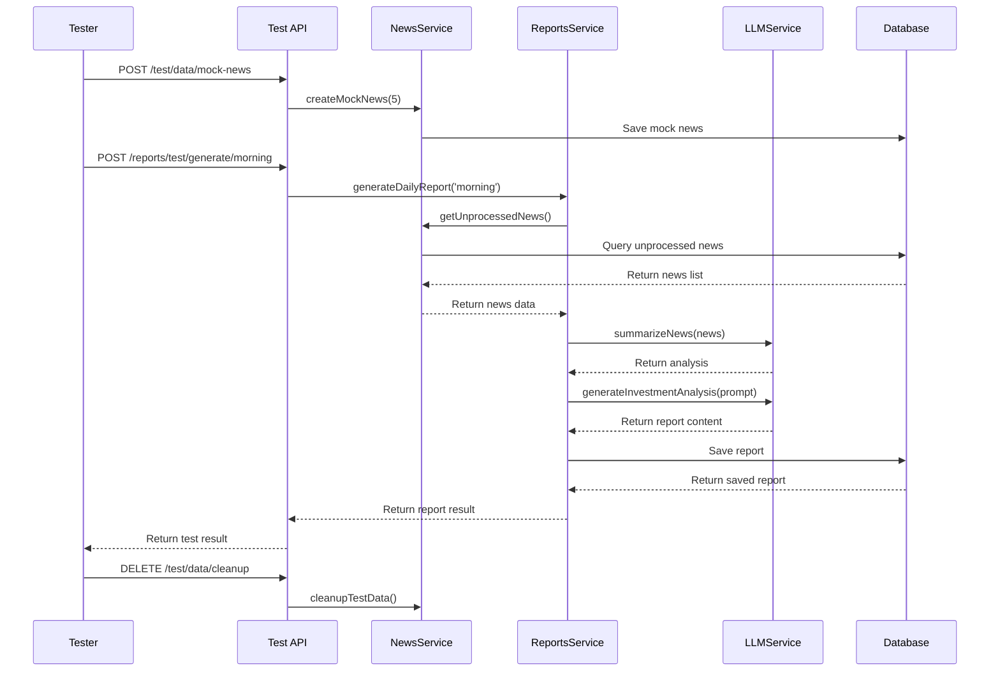
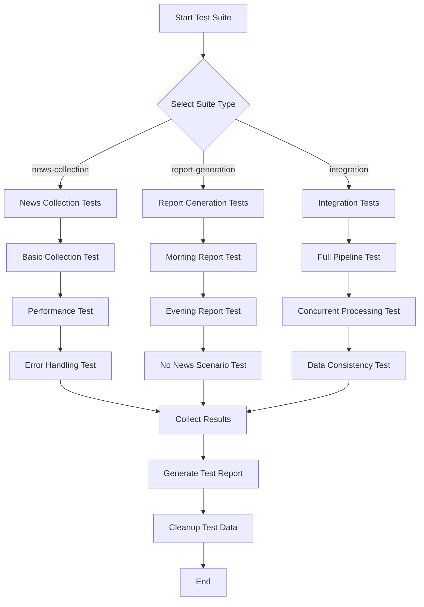
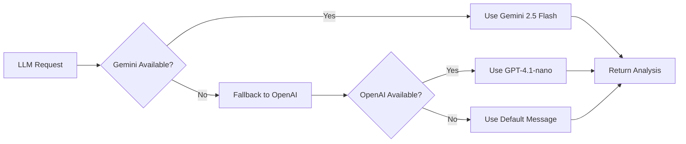
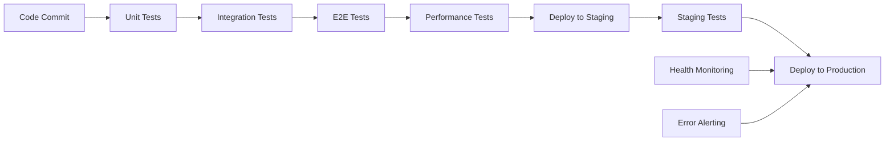

# Testing Strategy for Auto Investment Helper

This document outlines the comprehensive testing methodology for the batch-processing investment report system.

## Overview

The Auto Investment Helper is a batch-processing system that collects news, analyzes it using AI, and generates investment reports. Testing such a system requires special strategies to validate the complete data flow without waiting for scheduled cron jobs.

## Testing Architecture

```mermaid
graph TB
    subgraph "Testing Framework"
        A[Manual Trigger Endpoints] --> B[Test Utilities]
        B --> C[Integration Tests]
        C --> D[Performance Tests]
        D --> E[Health Monitoring]
    end
    
    subgraph "Data Flow Testing"
        F[News Collection Test] --> G[LLM Analysis Test]
        G --> H[Report Generation Test]
        H --> I[Data Validation Test]
    end
    
    subgraph "API Testing Endpoints"
        J[/test/health] --> K[System Health Check]
        L[/test/suites] --> M[Available Test Suites]
        N[/reports/test/generate] --> O[Manual Report Generation]
        P[/reports/test/flow/full] --> Q[End-to-End Flow Test]
    end
    
    A --> F
    B --> J
    C --> N
```

## Testing Components

### 1. Manual Trigger Endpoints

Instead of waiting for cron schedules, use these endpoints to trigger batch processes:

#### Report Generation Testing
```bash
# Generate morning report manually
POST /reports/test/generate/morning

# Generate evening report manually  
POST /reports/test/generate/evening

# Full pipeline test
POST /reports/test/flow/full
```

#### News Collection Testing
```bash
# Trigger news collection manually
POST /reports/test/news/collect

# Get system status
GET /reports/test/flow/status
```

### 2. Test Suites

#### News Collection Suite (`news-collection`)
- **Basic Collection Test**: Validates RSS feed parsing and database storage
- **Performance Test**: Ensures collection completes within time limits
- **Error Handling**: Tests graceful handling of failed RSS sources

#### Report Generation Suite (`report-generation`)
- **Morning Report Test**: Validates morning report structure and content
- **Evening Report Test**: Validates evening report structure and content
- **No News Scenario**: Tests report generation when no new news is available

#### Integration Suite (`integration`)
- **Full Pipeline Test**: End-to-end validation from news collection to report generation
- **Concurrent Processing**: Tests system under concurrent report generation
- **Data Consistency**: Validates data integrity throughout the pipeline

### 3. Testing Service

The `TestingService` provides comprehensive testing utilities:

```typescript
// Run specific test suite
const result = await testingService.runTestSuite('news-collection');

// Create mock data for testing
const mockNews = await testingService.createMockNews(5);

// Clean up test data
await testingService.cleanupTestData();

// Get system health status
const health = await testingService.getSystemHealth();
```

### 4. Mock Data Generation

For reliable testing, the system can generate mock news data:

```typescript
// Example mock news structure
{
  title: 'Fed Considers Interest Rate Adjustment',
  content: 'The Federal Reserve is considering...',
  url: 'https://test.example.com/fed-rates-...',
  source: 'Test Financial News',
  publishedAt: new Date(),
  tags: ['fed', 'interest rate', 'policy'],
  category: 'central_bank'
}
```

## Testing Flow Diagrams

### Complete Data Pipeline Testing



### Test Suite Execution Flow



## Performance Testing

### Time Limits and Expectations

| Operation | Expected Time | Maximum Time | Performance Grade |
|-----------|---------------|--------------|-------------------|
| News Collection | < 10s | 30s | Excellent < 10s, Good < 20s, Slow > 20s |
| Report Generation | < 30s | 60s | Excellent < 30s, Good < 45s, Slow > 45s |
| Full Pipeline | < 60s | 120s | Excellent < 60s, Good < 90s, Slow > 90s |

### Memory and CPU Monitoring

The testing framework monitors system resources:

```typescript
interface TestMetrics {
  duration: number;
  memoryUsage: {
    rss: number;
    heapUsed: number;
    heapTotal: number;
    external: number;
    arrayBuffers: number;
  };
  cpuUsage: {
    user: number;
    system: number;
  };
}
```

## Error Handling Testing

### LLM Service Fallback Testing



### News Source Failure Handling

The system should gracefully handle individual RSS source failures:

- Continue processing other sources
- Log failures for monitoring
- Maintain partial functionality
- Generate reports with available data

## API Testing Examples

### Basic Health Check
```bash
curl -X GET http://localhost:3000/test/health
```

Response:
```json
{
  "status": "healthy",
  "services": {
    "database": true,
    "newsService": true,
    "llmService": true,
    "reportsService": true
  },
  "metrics": {
    "memoryUsage": {...},
    "uptime": 3600,
    "newsCount": 150,
    "reportsCount": 12
  }
}
```

### Run Test Suite
```bash
curl -X POST http://localhost:3000/test/suites/integration/run
```

Response:
```json
{
  "success": true,
  "totalDuration": 45000,
  "results": [
    {
      "scenario": "full-pipeline-test",
      "result": {
        "success": true,
        "duration": 45000,
        "data": {
          "steps": [...],
          "totalSteps": 3,
          "successfulSteps": 3
        }
      }
    }
  ],
  "summary": {
    "passed": 1,
    "failed": 0,
    "total": 1
  }
}
```

### Manual Report Generation
```bash
curl -X POST http://localhost:3000/reports/test/generate/morning
```

Response:
```json
{
  "success": true,
  "report": {
    "id": 123,
    "title": "오전 투자 리포트 - 2024년 6월 15일",
    "reportType": "morning",
    "content": "...",
    "summary": "...",
    "newsAnalysis": {
      "processedCount": 5,
      "keyInsights": "..."
    }
  },
  "metrics": {
    "duration": 32000,
    "newsProcessed": 5,
    "startTime": "2024-06-15T09:00:00.000Z",
    "endTime": "2024-06-15T09:00:32.000Z"
  }
}
```

## Data Validation

### Report Content Validation

The testing framework validates generated reports for:

1. **Structure Completeness**
   - Title present and formatted correctly
   - Content meets minimum length requirements
   - Summary is concise but informative
   - News analysis includes processed count and insights

2. **Content Quality**
   - Investment recommendations are present
   - Risk level is set to 'conservative' for 27-year-old investor
   - Time horizon is 'long-term'
   - Content is relevant to investment decisions

3. **Data Consistency**
   - Processed news count matches actual processed items
   - Report creation time is reasonable
   - Database references are valid

### News Data Validation

Mock news data validation ensures:

- Unique URLs to prevent duplicates
- Proper categorization (korean, international, central_bank)
- Relevant tags for investment analysis
- Realistic publication dates

## Environment-Specific Testing

### Development Environment
- Use mock data for predictable tests
- Enable all test endpoints
- Detailed logging for debugging

### Staging Environment
- Use real RSS feeds but with test API keys
- Limited test endpoints for security
- Performance monitoring enabled

### Production Environment
- Test endpoints disabled by default
- Health monitoring only
- Automated alerting for failures

## Continuous Integration

### Test Pipeline



### Automated Test Execution

```bash
# Run all tests
npm run test:all

# Run specific test suites
npm run test:unit
npm run test:e2e
npm run test:integration

# Run performance tests
npm run test:performance
```

## Monitoring and Alerts

### Key Metrics to Monitor

1. **System Health**
   - Service availability
   - Database connectivity
   - LLM service response times

2. **Business Metrics**
   - News collection success rate
   - Report generation success rate
   - Average processing times

3. **Error Rates**
   - RSS source failure rates
   - LLM API failure rates
   - Database operation failures

### Alert Thresholds

| Metric | Warning | Critical |
|--------|---------|----------|
| News Collection Failure | > 20% | > 50% |
| Report Generation Failure | > 5% | > 15% |
| LLM Response Time | > 30s | > 60s |
| Memory Usage | > 80% | > 95% |

## Best Practices

### Testing Guidelines

1. **Always use mock data for unit tests**
2. **Clean up test data after each test**
3. **Test error scenarios, not just happy paths**
4. **Monitor resource usage during tests**
5. **Validate data consistency across operations**

### Performance Optimization

1. **Limit news processing to reasonable batches (25 items)**
2. **Implement timeout mechanisms for LLM calls**
3. **Use database connection pooling**
4. **Cache frequently accessed data**

### Security Considerations

1. **Disable test endpoints in production**
2. **Use separate API keys for testing**
3. **Sanitize all input data**
4. **Log security-relevant events**

## Troubleshooting Common Issues

### News Collection Failures
- Check RSS feed availability
- Verify network connectivity
- Review user agent and timeout settings

### Report Generation Failures
- Validate LLM API keys and quotas
- Check for rate limiting
- Verify database connectivity

### Performance Issues
- Monitor memory usage and garbage collection
- Check database query performance
- Review LLM response times

### Data Inconsistency
- Verify transaction boundaries
- Check for race conditions
- Review data validation logic

## Integration with CI/CD

The testing framework integrates seamlessly with CI/CD pipelines:

```yaml
# Example GitHub Actions workflow
name: Test Suite
on: [push, pull_request]

jobs:
  test:
    runs-on: ubuntu-latest
    steps:
      - uses: actions/checkout@v2
      - name: Setup Node.js
        uses: actions/setup-node@v2
        with:
          node-version: '18'
      - name: Install dependencies
        run: npm ci
      - name: Run unit tests
        run: npm run test
      - name: Run integration tests
        run: npm run test:e2e
      - name: Run performance tests
        run: npm run test:performance
```

This comprehensive testing strategy ensures the reliability, performance, and quality of the Auto Investment Helper system while providing developers with the tools they need to validate batch processing workflows effectively.