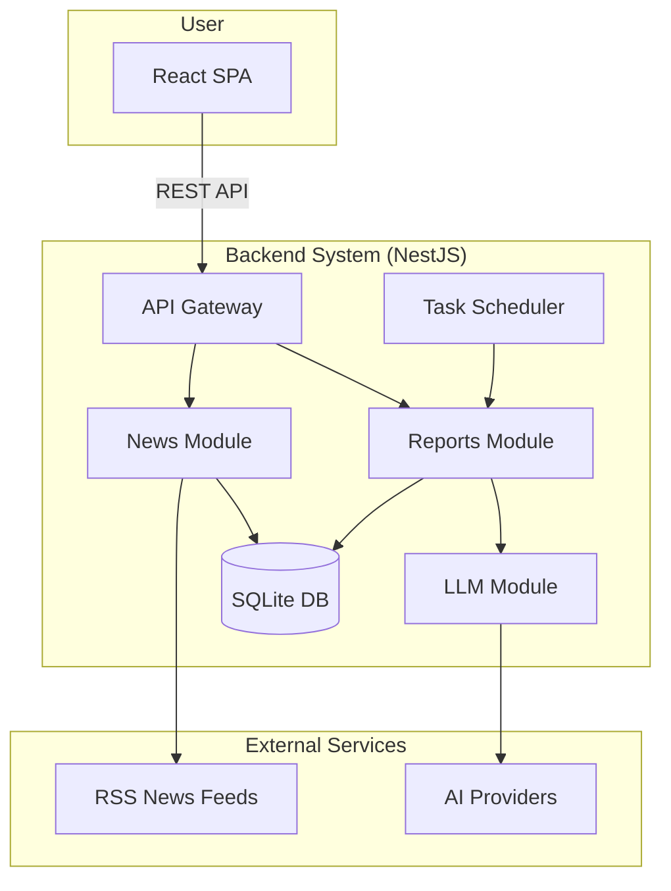

# Development Guide

This guide provides all the necessary information for developing the Auto Investment Helper, from architecture to deployment.

## 1. System Architecture

The system consists of a NestJS backend, a React frontend, and several external services for data and AI.



-   **Backend**: A modular NestJS application responsible for business logic, data persistence, and external API communication.
-   **Frontend**: A React SPA for user interaction and data visualization.
-   **External Services**: RSS feeds for news aggregation and AI providers (e.g., Gemini) for analysis.

## 2. Project Structure

The project follows an independent services architecture where each service can be developed, tested, and deployed separately.

```
auto-investment-helper/
├── backend/            # NestJS Backend (Independent)
│   ├── src/
│   │   ├── modules/    # Core feature modules (reports, news, llm)
│   │   ├── entities/   # TypeORM entities
│   │   ├── config/     # Configuration
│   │   └── main.ts     # Application entry point
│   ├── data/           # SQLite database file
│   ├── package.json    # Backend dependencies
│   └── test/           # E2E tests
├── frontend/           # React Frontend (Independent)
│   ├── src/
│   │   ├── components/ # UI Components
│   │   ├── services/   # API services
│   │   └── App.tsx     # Main application component
│   ├── package.json    # Frontend dependencies
│   └── public/
├── docs/               # Project documentation
└── docker-compose.yml  # Container orchestration
```

## 3. Getting Started

### Prerequisites

-   Node.js v18+
-   npm v9+
-   Git
-   Docker (for production deployment)

### Development Setup

1.  **Clone the repository**:
    ```bash
    git clone <repository-url>
    cd auto-investment-helper
    ```

2.  **Setup Backend**:
     ```bash
     cd backend
     npm install
     cp .env.example .env
     # Edit .env and add your GEMINI_API_KEY
     npm run start:dev
     ```

3.  **Setup Frontend** (in another terminal):
     ```bash
     cd frontend
     npm install
     npm start
     ```

### Production Deployment

```bash
# Setup environment
cp backend/.env.example backend/.env
# Edit backend/.env and add your GEMINI_API_KEY

# Deploy with Docker Compose
docker-compose up --build
```

## 4. Development Workflow

### Backend Development

Navigate to the backend directory and use standard NestJS commands:

```bash
cd backend

# Install dependencies
npm install

# Development with hot-reload
npm run start:dev

# Build for production
npm run build

# Start production server
npm run start:prod

# Run tests
npm run test          # Unit tests
npm run test:e2e      # E2E tests
npm run test:all      # All tests

# Linting and formatting
npm run lint          # Lint with auto-fix
npm run format        # Format code
```

### Frontend Development

Navigate to the frontend directory and use standard React commands:

```bash
cd frontend

# Install dependencies
npm install

# Development server
npm start

# Build for production
npm run build

# Run tests
npm test              # Interactive mode
npm run test:coverage # With coverage report

# Linting and formatting
npm run lint          # Lint with auto-fix
npm run lint:check    # Lint check only
npm run format        # Format code
npm run format:check  # Format check only
```

### Docker Development

For production-like environment testing:

```bash
# Build and start all services
docker-compose up --build

# Run in background
docker-compose up -d

# View logs
docker-compose logs -f

# Stop services
docker-compose down
```

## 5. Service Independence

Each service (backend/frontend) is completely independent:

- **Separate Dependencies**: Each has its own `package.json`
- **Independent Deployment**: Can be deployed separately
- **Technology Flexibility**: Backend could be replaced with Python/Go, frontend with Vue/Angular
- **Isolated Testing**: Each service has its own test suite

### Adding New Services

To add a new service (e.g., `mobile-app`, `admin-panel`):

1. Create a new directory with its own `package.json`
2. Add the service to `docker-compose.yml` if needed
3. Follow the same independent development pattern

## 6. Configuration Files

- **Backend**: `.eslintrc.js`, `.prettierrc` (NestJS optimized)
- **Frontend**: `.eslintrc.js`, `.prettierrc` (React optimized)
- **Docker**: `Dockerfile` in each service directory

## 7. IDE Setup Recommendations

For VSCode users:
- ESLint extension
- Prettier - Code formatter
- TypeScript Importer

Workspace settings (`.vscode/settings.json`):
```json
{
  "editor.formatOnSave": true,
  "editor.codeActionsOnSave": {
    "source.fixAll.eslint": true
  }
}
```

## 8. Common Issues

- **Port Conflicts**: Use `lsof -i :<port>` and `kill -9 <PID>` to free ports
- **API Key Errors**: Ensure `GEMINI_API_KEY` in `backend/.env` is correct
- **Database Issues**: Delete `backend/data/investment.db` to reset schema
- **Docker Issues**: Run `docker-compose down` and `docker system prune` to clean up 