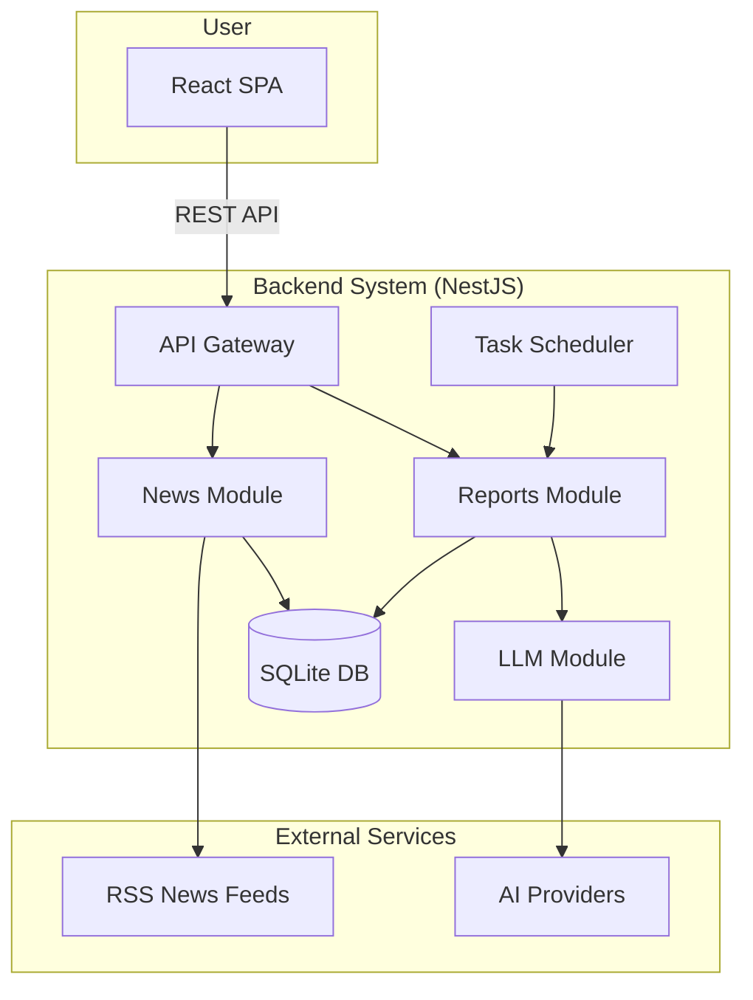

# Development Guide

This guide provides all the necessary information for developing the Auto Investment Helper, from architecture to deployment.

## 1. System Architecture

The system consists of a NestJS backend, a React frontend, and several external services for data and AI.



-   **Backend**: A modular NestJS application responsible for business logic, data persistence, and external API communication.
-   **Frontend**: A React SPA for user interaction and data visualization.
-   **External Services**: RSS feeds for news aggregation and AI providers (e.g., Gemini) for analysis.

## 2. Project Structure

The project is a monorepo containing the `backend` and `frontend` applications.

```
auto-investment-helper/
├── backend/        # NestJS Backend
│   ├── src/
│   │   ├── modules/    # Core feature modules (reports, news, llm)
│   │   ├── entities/   # TypeORM entities
│   │   ├── config/     # Configuration
│   │   └── main.ts     # Application entry point
│   ├── data/         # SQLite database file
│   └── test/         # E2E tests
├── frontend/       # React Frontend
│   ├── src/
│   │   ├── components/ # UI Components
│   │   ├── services/   # API services
│   │   └── App.tsx     # Main application component
│   └── public/
├── docs/           # Project documentation
└── package.json    # Root package configuration
```

## 3. Getting Started

### Prerequisites

-   Node.js v18+
-   npm v9+
-   Git

### Setup

1.  **Clone the repository**:
    ```bash
    git clone <repository-url>
    cd auto-investment-helper
    ```

2.  **Install dependencies**:
    ```bash
    npm install
    ```
    *This command installs dependencies for the root, backend, and frontend simultaneously.*

3.  **Configure environment variables**:
    ```bash
    # Create backend .env file
    cp backend/.env.example backend/.env
    # Add your GEMINI_API_KEY to backend/.env
    ```

4.  **Run development servers**:
    ```bash
    npm run dev
    ```
    -   Backend runs on `http://localhost:3001`
    -   Frontend runs on `http://localhost:3000`

## 4. Development Workflow

### Testing

Run all tests for both backend and frontend:

```bash
npm test
```

To run tests for a specific application, navigate to its directory (`backend` or `frontend`) and run `npm test`.

### Linting and Formatting

이 프로젝트는 ESLint와 Prettier를 사용하여 코드 품질과 일관성을 유지합니다.

#### 전체 프로젝트 린트 및 포맷팅

```bash
# 전체 프로젝트 린트 (자동 수정 포함)
npm run lint

# 전체 프로젝트 포맷팅
npm run format
```

#### 개별 프로젝트 명령어

**백엔드 (NestJS/TypeScript)**:
```bash
cd backend

# 린트 체크 및 자동 수정
npm run lint

# 코드 포맷팅
npm run format
```

**프론트엔드 (React/TypeScript)**:
```bash
cd frontend

# 린트 체크 및 자동 수정
npm run lint

# 린트 체크만 (수정 없이)
npm run lint:check

# 코드 포맷팅
npm run format

# 포맷팅 체크만 (수정 없이)
npm run format:check
```

#### 설정 파일

- **백엔드**: `.eslintrc.js`, `.prettierrc`
- **프론트엔드**: `.eslintrc.js`, `.prettierrc`

각 설정은 해당 기술 스택에 최적화되어 있으며, TypeScript와 각 프레임워크(NestJS/React)의 모범 사례를 따릅니다.

#### IDE 설정 권장사항

VSCode 사용자는 다음 확장을 설치하는 것을 권장합니다:
- ESLint
- Prettier - Code formatter
- TypeScript Importer

저장 시 자동 포맷팅을 위해 VSCode 설정에 다음을 추가하세요:
```json
{
  "editor.formatOnSave": true,
  "editor.codeActionsOnSave": {
    "source.fixAll.eslint": true
  }
}
```

### Common Issues

-   **Port Conflict**: If port `3000` or `3001` is in use, find and stop the process using `lsof -i :<port>` and `kill -9 <PID>`.
-   **API Key Error**: Ensure your `GEMINI_API_KEY` in `backend/.env` is correct and has the necessary permissions.
-   **Database Schema Issues**: For schema mismatches in development, delete `backend/data/investment.db` and restart the backend server. TypeORM will regenerate the schema. 