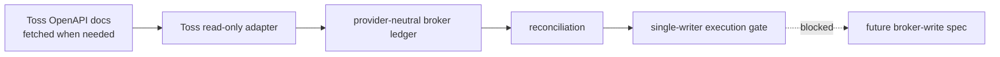

# Toss OpenAPI Source Index

Status: supporting documentation source index.

This repository must not vendor-copy Toss Securities Open API documentation as
the local source of truth. Read the official documents at implementation or
review time, then keep only this link index and local integration notes.

## Source Of Truth

- Human docs: https://developers.tossinvest.com/docs
- LLM/documentation entrypoint: https://developers.tossinvest.com/llms.txt
- Overview Markdown: https://openapi.tossinvest.com/openapi-docs/overview.md
- API reference Markdown: https://openapi.tossinvest.com/openapi-docs/latest/api-reference/README.md
- Canonical OpenAPI JSON: https://openapi.tossinvest.com/openapi-docs/latest/openapi.json

Use the OpenAPI JSON as the endpoint/schema authority. Use the Markdown files
for human review and runbook context.

## Fetch Commands

```bash
curl -fsSL https://developers.tossinvest.com/llms.txt
curl -fsSL https://openapi.tossinvest.com/openapi-docs/overview.md
curl -fsSL https://openapi.tossinvest.com/openapi-docs/latest/api-reference/README.md
curl -fsSL https://openapi.tossinvest.com/openapi-docs/latest/openapi.json \
  | jq -r '.info.title, .info.version, (.paths | keys[])'
```

For a focused endpoint review:

```bash
curl -fsSL https://openapi.tossinvest.com/openapi-docs/latest/api-reference/Apis/AssetApi.md
curl -fsSL https://openapi.tossinvest.com/openapi-docs/latest/api-reference/Apis/OrderHistoryApi.md
curl -fsSL https://openapi.tossinvest.com/openapi-docs/latest/api-reference/Models/HoldingsItem.md
curl -fsSL https://openapi.tossinvest.com/openapi-docs/latest/api-reference/Models/Order.md
```

## Endpoint Groups

| Group         | Link                                                                                     | Integration use                                    |
| ------------- | ---------------------------------------------------------------------------------------- | -------------------------------------------------- |
| Auth          | https://openapi.tossinvest.com/openapi-docs/latest/api-reference/Apis/AuthApi.md         | OAuth2 client credentials token.                   |
| Account       | https://openapi.tossinvest.com/openapi-docs/latest/api-reference/Apis/AccountApi.md      | Account list and `accountSeq` discovery.           |
| Asset         | https://openapi.tossinvest.com/openapi-docs/latest/api-reference/Apis/AssetApi.md        | Read-only holdings snapshot.                       |
| Order History | https://openapi.tossinvest.com/openapi-docs/latest/api-reference/Apis/OrderHistoryApi.md | Read-only open-order and partial-fill observation. |
| Order Info    | https://openapi.tossinvest.com/openapi-docs/latest/api-reference/Apis/OrderInfoApi.md    | Buying power and future order-preview inputs.      |
| Market Info   | https://openapi.tossinvest.com/openapi-docs/latest/api-reference/Apis/MarketInfoApi.md   | USD/KRW conversion and market calendar.            |
| Market Data   | https://openapi.tossinvest.com/openapi-docs/latest/api-reference/Apis/MarketDataApi.md   | Prices, candles, orderbook, trades.                |
| Stock Info    | https://openapi.tossinvest.com/openapi-docs/latest/api-reference/Apis/StockInfoApi.md    | Stock master data and warnings.                    |
| Order         | https://openapi.tossinvest.com/openapi-docs/latest/api-reference/Apis/OrderApi.md        | Future broker-write spec only; blocked now.        |

## Local Integration Rule

Toss-specific code must stay behind a broker adapter boundary:



The adapter may read OAuth token, account, holdings, buying power, exchange
rate, and open-order status when explicitly enabled. It must not expose Toss
credentials, raw account identifiers, or order payloads to LLM prompts,
frontend state, research artifacts, or logs.

Broker writes remain out of scope until a separate user-approved broker-write
implementation spec exists.
