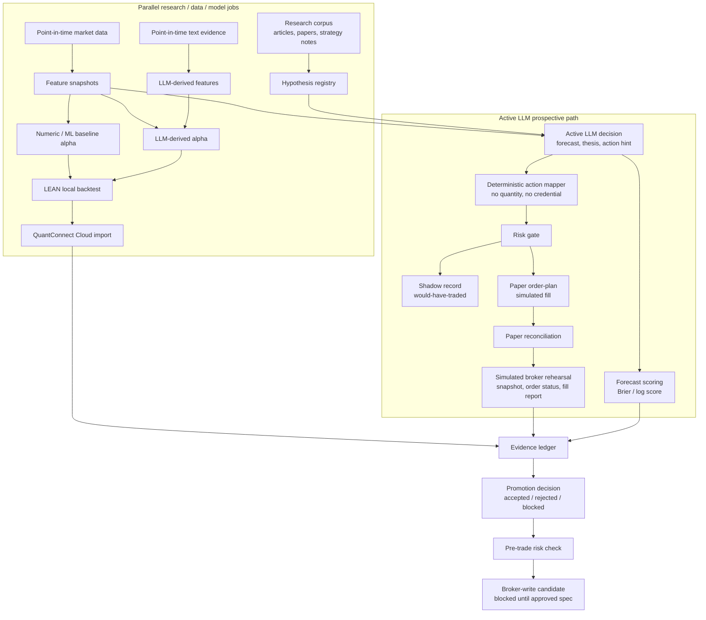
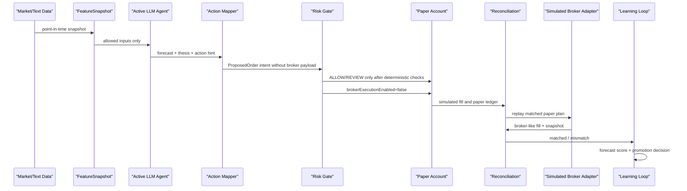
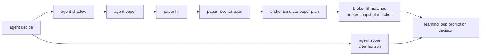

# Lincei Quant Research Engine: 지금 구조를 처음부터 이해하기

Status: supporting review note.

Last checked: 2026-06-02.

Source of truth: [SPEC.md](SPEC.md), [terminology.md](terminology.md), and [docs/spec/](docs/spec).

이 문서는 공식 spec이 아니라, 프로젝트를 처음 보는 사람이 “이 시스템이 어떻게 판단하고, 검증하고, 돈을 넣을 후보를 고르는지” 이해하기 위한 설명입니다.

## 1. 한 문장으로

이 프로젝트는 **내 돈을 바로 넣는 자동매매 봇**이 아니라, 내 돈을 넣어도 되는 전략 후보를 만들기 위해 아래 과정을 ledger로 증명하는 시스템입니다.

```text
data
  -> forecast / alpha
  -> validation
  -> deterministic risk gate
  -> paper or shadow order rehearsal
  -> reconciliation
  -> promotion decision
  -> broker-write candidate
```

목표는 실제 수익화가 맞습니다. 다만 지금 구현은 “실제 주문을 자동 전송”하기 전 단계입니다. 현재 중요한 목표는 **어떤 전략이 돈을 넣을 만큼 검증됐는지, 어떤 전략은 아직 막혔는지**를 분리해서 기록하는 것입니다.

## 2. 핵심 용어

| 용어                        | 뜻                                                                                                                                            |
| --------------------------- | --------------------------------------------------------------------------------------------------------------------------------------------- |
| `feature`                   | 예측 입력값. 예: 20일 수익률, 변동성, FOMC tone score.                                                                                        |
| `alpha`                     | 기대 초과수익 또는 forecast. 주문 자체가 아닙니다.                                                                                            |
| `AlphaDecision`             | LEAN/backtestable flow에서 쓰는 typed alpha record.                                                                                           |
| `LLM-derived feature`       | LLM이 텍스트를 읽고 만든 구조화 입력값. 주문이 아니라 feature입니다.                                                                          |
| `active LLM agent decision` | LLM이 투자위원회처럼 남기는 forecast, thesis, counter-thesis, action-plan hint.                                                               |
| `action-plan hint`          | LLM이 “노출을 늘려라/줄여라/보류하라”처럼 제안하는 의도. 수량, 계좌, broker payload는 포함하면 안 됩니다.                                     |
| `backtest`                  | 과거 데이터로 재현하는 검증. point-in-time 데이터만 써야 합니다.                                                                              |
| `prospective paper arena`   | 지금부터 LLM 판단을 기록하고, 시간이 지난 뒤 실제 결과로 scoring하는 평가장.                                                                  |
| `shadow trading`            | 실제 주문은 보내지 않고 would-have-traded intent만 기록하는 운영 리허설.                                                                      |
| `paper order-plan`          | 실제 broker가 아니라 내부 paper account에 주문 계획과 simulated fill을 남기는 기록.                                                           |
| `simulated broker adapter`  | 실제 증권사 API가 아니라, paper plan을 broker snapshot / order status / fill report 형태로 재생해서 계약과 reconciliation을 검증하는 adapter. |
| `risk gate`                 | stale data, cap 초과, 금지 자산, broker credential 유입 같은 위험을 deterministic하게 막는 fail-closed gate.                                  |
| `reconciliation`            | 의도한 상태와 ledger/account 상태가 맞는지 비교하는 절차.                                                                                     |
| `broker-write path`         | 실제 submit/cancel/replace/flatten. 별도 승인 전까지 blocked입니다.                                                                           |

중요한 구분:

```text
alpha != order
LLM decision != broker payload
paper/shadow evidence != real-money approval
blocked evidence == useful evidence
```

## 3. 전체 그림



병렬화해도 되는 부분:

- research corpus ingest
- market/text data ingest
- feature generation
- LLM-derived feature jobs
- ablation variants
- local LEAN backtests
- QuantConnect Cloud artifact imports
- historical episode replay jobs

병렬화하면 안 되는 부분:

- 최종 portfolio target consolidation
- risk gate
- paper/shadow execution intent
- reconciliation
- future broker write

이 구간은 돈과 직접 연결될 수 있으므로 single-writer와 fail-closed가 필요합니다.

## 4. LLM은 두 방식으로 쓰인다

### 4.1 LLM-derived feature path

LLM이 텍스트를 읽고 feature를 만듭니다.

```text
FOMC statement
  -> LLM extracts semantic feature
  -> FeatureSnapshot
  -> numeric / ML / meta alpha consumes it
  -> LEAN backtest
```

이 방식은 과거 시점별 LLM output을 미리 만들어 고정하면 backtest에 넣을 수 있습니다. 비용은 들지만 비교적 재현 가능합니다.

### 4.2 Active LLM agent path

LLM이 직접 forecast와 thesis를 남깁니다.

```text
current FeatureSnapshot
  -> active LLM agent decision
  -> deterministic action mapper
  -> risk gate
  -> shadow + paper order-plan
  -> horizon 후 realized label
  -> Brier score / log score / action review
```

이 방식은 전통적인 backtest만으로 검증하기 어렵습니다. prompt나 policy가 바뀌면 과거 전체 LLM output을 다시 만들어야 하고, LLM이 과거 이후 정보를 알고 있을 가능성도 있습니다. 그래서 active LLM agent는 **prospective evaluation**이 주 검증 방식입니다.

## 5. 결정부터 투자 후보까지



LLM이 할 수 있는 것:

- 방향 forecast
- 확률 forecast
- thesis / counter-thesis
- invalidation condition
- action hint

LLM이 하면 안 되는 것:

- 최종 주문 수량 결정
- broker account id 선택
- broker credential 접근
- raw broker order payload 작성
- leverage, short, derivative 같은 scope 확장
- broker submit/cancel/replace/flatten 실행

## 6. 백테스트는 폐기하지 않는다

백테스트는 여전히 필요합니다. 다만 역할이 좁아집니다.

| 대상                         | 검증 방식                                                       |
| ---------------------------- | --------------------------------------------------------------- |
| Numeric/rule baseline        | LEAN/QuantConnect backtest가 핵심 검증 수단입니다.              |
| ML baseline                  | feature와 label이 point-in-time이면 backtest/replay 가능합니다. |
| LLM-derived feature strategy | LLM output을 먼저 고정한 뒤 replay합니다.                       |
| Active LLM agent             | backtest보다 prospective paper/shadow arena가 핵심입니다.       |

정리하면:

```text
baseline은 backtest로 강하게 검증
active LLM agent는 forward paper/shadow arena로 검증
둘을 같은 evidence ledger에서 비교
```

## 7. 지금 구현된 것

현재 구현은 active LLM decision이 단순 ledger에서 멈추지 않고, 기존 paper order-plan/reconciliation 경로까지 들어갑니다.



구현된 operator commands:

```bash
bun --cwd=backend run lincei -- agent decide --symbols SPY,QQQ --json
bun --cwd=backend run lincei -- agent shadow --json
bun --cwd=backend run lincei -- agent paper --json
bun --cwd=backend run lincei -- broker simulate-paper-plan --json
bun --cwd=backend run lincei -- agent score --json
bun --cwd=backend run lincei -- agent status --json
bun --cwd=backend run lincei -- capital run --max-backtest-workers 1 --json
```

구현된 ledger:

- `agent_evaluation_runs`
- `agent_decision_records`
- `agent_forecast_labels`
- `live_shadow_records`
- `investment_proposals`
- `paper_order_plans`
- `broker_order_commands`
- `broker_order_status_records`
- `broker_fills`
- `broker_snapshots`
- `promotion_decisions`

중요한 구현 상태:

- active LLM decision은 broker payload가 아니라 sanitized action hint만 저장합니다.
- shadow path는 `evidence-mode:active-llm-agent-shadow`로 기존 LEAN shadow evidence와 분리됩니다.
- paper bridge는 기존 control-plane의 proposal, approval, paper execution, reconciliation을 그대로 재사용합니다.
- active LLM paper plan은 `active-agent-paper:<runId>:<hash>` idempotency key를 씁니다.
- simulated broker rehearsal은 paper order-plan을 broker snapshot, broker order status, broker fill report로 재생한 뒤 기존 broker reconciliation을 통과시킵니다.
- learning loop는 active-agent shadow record를 LEAN/Cloud promotion evidence로 잘못 쓰지 않습니다.
- active-agent promotion decision은 현재 `blocked`로 기록됩니다. 이유는 prospective labels, paper reconciliation, thresholds가 충분히 쌓여야 하기 때문입니다.

## 7.1 Broker API가 없을 때 새로 검증되는 것

실제 증권사 API가 없어도 지금은 아래를 검증할 수 있습니다.

```text
paper order-plan
  -> dry-run broker order command
  -> simulated broker order status
  -> simulated broker fill report
  -> broker fill reconciliation
  -> simulated broker snapshot
  -> broker snapshot reconciliation
```

이 명령이 핵심입니다.

```bash
bun --cwd=backend run lincei -- broker simulate-paper-plan --json
```

성공하면 의미하는 것:

- paper plan의 fill이 broker fill report 형태로 변환되어도 수량, notional, fee가 맞습니다.
- paper account의 cash/position/equity가 broker snapshot 형태로 변환되어도 reconciliation이 맞습니다.
- dry-run broker order command와 broker order status shape가 연결됩니다.
- real broker write는 여전히 꺼져 있습니다.

성공해도 의미하지 않는 것:

- 실제 증권사 주문이 가능하다는 뜻은 아닙니다.
- 실제 계좌 잔고/보유종목을 읽었다는 뜻도 아닙니다.
- 실제 submit/cancel/replace/flatten readiness가 생겼다는 뜻도 아닙니다.
- promotion evidence나 broker-write approval을 대체하지 않습니다.

왜 이게 중요한가:

증권사 API를 나중에 붙일 때 바로 어려워지는 부분은 “주문 API 호출” 자체만이 아닙니다. 더 자주 문제가 되는 부분은 broker가 돌려주는 order status, fill, account snapshot을 우리 내부 paper/risk ledger와 정확히 맞추는 일입니다. simulated broker rehearsal은 이 계약을 미리 고정해서, 실제 adapter 구현 때 바꿔야 할 부분을 provider mapping으로 좁혀줍니다.

## 8. 아직 안 된 것

아직 실제 돈을 자동으로 넣지는 않습니다.

남은 core gap:

1. 실제 broker read-only adapter가 provider 계좌 snapshot/fill을 읽는 것.
2. 실제 broker write adapter.
3. broker submit/cancel/replace/flatten.
4. broker open-order polling and emergency controls.
5. live fill reconciliation with a real broker.
6. active LLM promotion thresholds.
7. 충분한 prospective evaluation 기간과 label 수.
8. QuantConnect Cloud promotion evidence import for selected baseline variants.
9. self-funded capital staircase policy.

여기서 “broker API가 없다”만 문제가 아닙니다. broker API가 생겨도 바로 돈을 넣으면 안 됩니다. 최소한 아래 evidence가 필요합니다.

```text
baseline comparator exists
active LLM decisions retained
forecast labels retained
shadow would-have-traded retained
paper order-plan reconciled
simulated broker rehearsal passed
promotion decision recorded
pre-trade risk check ready
broker-write spec explicitly approved
```

## 9. 돈을 넣는 관점의 다음 우선순위

가장 직접적인 순서는 아래입니다.

```text
1. current market data ingest 안정화
2. agent decide를 매일/정기적으로 실행
3. agent paper로 paper order-plan과 reconciliation 축적
4. broker simulate-paper-plan으로 broker-side 계약 리허설 축적
5. horizon 후 agent score로 forecast label 축적
6. numeric/ML baseline과 active LLM agent 성능 비교
7. promotion threshold 정의
8. 작은 self-funded capital staircase spec 작성
9. broker read-only adapter 구현
10. broker-write adapter 구현
```

Darwinex/Zero는 이 다음입니다. 먼저 내 자본으로 검증 가능한 signal과 track record가 있어야 Darwinex/Zero에 올릴 의미가 생깁니다.

## 10. 이 프로젝트가 앞으로 가는지 보는 질문

1. 이 decision은 그 시점에 알 수 있던 data만 썼나?
2. LLM output이 broker order나 final quantity로 저장되지 않았나?
3. 실패, blocked, abstain 기록도 winner와 같이 남았나?
4. backtest 결과와 prospective paper/shadow 결과가 분리되어 있나?
5. forecast가 시간이 지난 뒤 실제 결과로 scoring됐나?
6. risk gate가 unknown/stale/over-cap 상태를 blocked로 처리하나?
7. paper order-plan이 expected state와 account ledger 차이를 reconciliation으로 잡아내나?
8. simulated broker fill/snapshot이 paper ledger와 matched 되나?
9. active-agent shadow evidence가 LEAN/Cloud promotion evidence로 오염되지 않나?
10. real broker write로 넘어가기 전에 user-approved broker-write spec이 있나?

현재 답은 “active LLM decision에서 paper reconciliation, 그리고 simulated broker fill/snapshot reconciliation까지의 vertical slice는 됐다”입니다. 다음 병목은 실제 broker API 자체보다, **충분한 prospective evidence와 promotion threshold를 쌓고, 실제 provider read-only adapter로 계좌 truth를 읽는 것**입니다.
